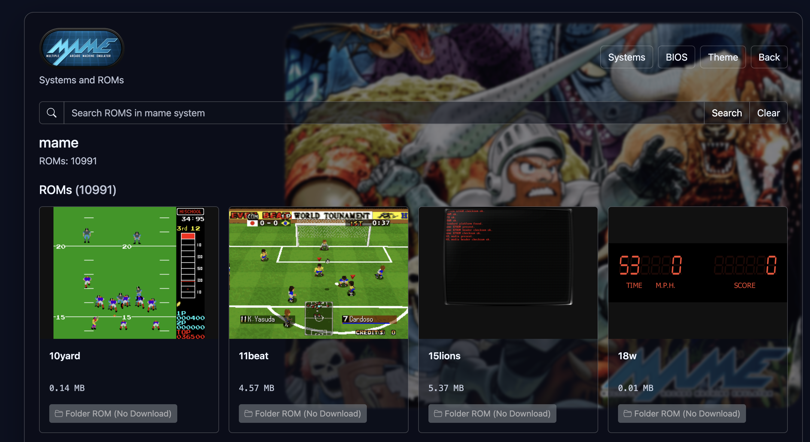
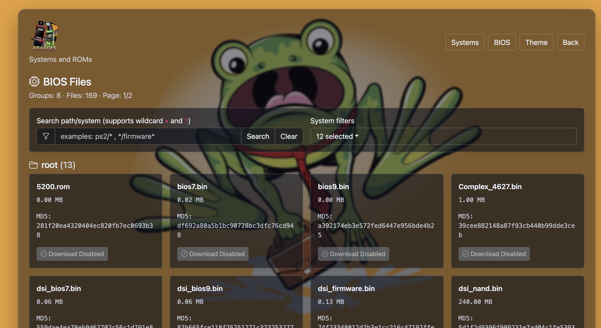
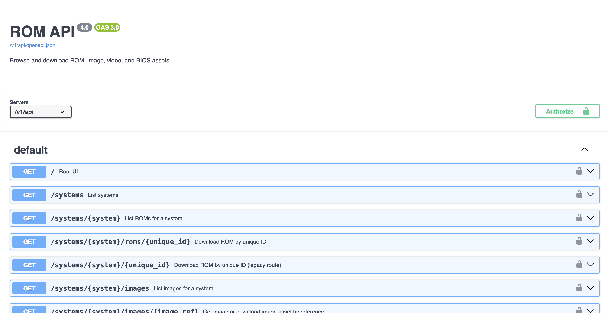

# ROMS API

HTTPS Basic-Auth API + web UI for browsing Batocera ROMs/BIOS/theme assets.

API base path: `/v1/api`

## TL;DR: Run It Now

On the Batocera machine, run one of these:

### Manually Start

```bash
curl -fsSL "https://gitlab.com/batocera_addons/roms-api/-/raw/main/scripts/run_now.sh?ref_type=heads" -o /tmp/run_now.sh && chmod +x /tmp/run_now.sh && ROM_API_BASE_URL="https://gitlab.com/batocera_addons/roms-api/-/raw/main" ROM_API_USERNAME="admin" ROM_API_PASSWORD="changeme" /tmp/run_now.sh
```

The script uses `ROM_API_USERNAME`/`ROM_API_PASSWORD` (or `USERNAME`/`PASSWORD`) if set, and only prompts when missing.
It downloads runtime files to `/userdata/system/.rom-api` (or `$HOME/.rom-api`) and removes that folder plus `/tmp/run_now.sh` when the process exits.

### Batocera Auto-Start (`/userdata/system/custom.sh`)

Add this to `/userdata/system/custom.sh` to start the API automatically once networking is up.
Update `ROM_API_USERNAME` and `ROM_API_PASSWORD` to your own values before using it.

```bash
#!/bin/bash

(
# Loop until we can ping Google's DNS
while ! ping -c 1 -W 2 8.8.8.8 > /dev/null 2>&1; do
  sleep 5
done

# Once online, run your command
curl -fsSL "https://gitlab.com/batocera_addons/roms-api/-/raw/main/scripts/run_now.sh?ref_type=heads" -o /tmp/run_now.sh && \
chmod +x /tmp/run_now.sh && \
ROM_API_BASE_URL="https://gitlab.com/batocera_addons/roms-api/-/raw/main" \
ROM_API_USERNAME="replace-with-your-username" \
ROM_API_PASSWORD="replace-with-your-password" /tmp/run_now.sh
) &
```

## API Docs (OpenAPI + Swagger)

- `GET /v1/api/openapi.json`
  - Machine-readable OpenAPI 3 spec for this API.
  - Use this for code generation, API validation, and tooling/integration workflows.

- `GET /v1/api/swagger`
  - Browser-based interactive API docs powered by Swagger UI.
  - Uses `/v1/api/openapi.json` as the source and lets you explore endpoints and test requests.

## Run

```bash
export ROM_API_USERNAME="admin"
export ROM_API_PASSWORD="changeme"
export HTTPS_PORT=8443
export ROMS_ROOT="./local-data/roms"
export BIOS_ROOT="./local-data/bios"
export TLS_SELF_SIGNED_DIR="./local-data/certs"
export LOG_DIR="./local-data/logs"
export LOG_MAX_BYTES=5242880
export LOG_BACKUP_COUNT=5
export ALLOW_CONTENT_DOWNLOAD=true
mkdir -p "$ROMS_ROOT" "$BIOS_ROOT" "$TLS_SELF_SIGNED_DIR" "$LOG_DIR"
python3 app/main.py
```

Open: `https://127.0.0.1:8443`

## Mock Server (Non-Batocera Local Testing)

Run a local HTTP mock server with realistic fake Batocera-style data:

```bash
python3 scripts/run_mock_server.py
```

Default mock server settings:
- URL: `http://127.0.0.1:8080`
- Auth: `admin` / `changeme`
- Data root: `local-data/mock-userdata`

You can override with env vars, for example:

```bash
MOCK_DATA_ROOT=/tmp/mock-userdata HTTPS_PORT=9090 python3 scripts/run_mock_server.py
```

## Auth + TLS

- Auth: HTTP Basic Auth
- TLS: self-signed by default
- `curl` examples use `-k` for self-signed certs
- Public route without auth: `/v1/api/public/systems/{system}/images/{image_file}`

## Download Toggle

- `ALLOW_CONTENT_DOWNLOAD=true` (default): enable ROM/BIOS downloads
- `ALLOW_CONTENT_DOWNLOAD=false`: disable download links/actions and block download routes
- Backward-compatible aliases: `DOWNLOAD`, `DOWNLOADS_ENABLED`

## Admin Toggle

- `ALLOW_ADMIN=true` (default): enable Admin API endpoints and Admin UI features
- `ALLOW_ADMIN=false`: disable `/v1/api/admin/*` routes (returns `403`) and hide Admin UI entry points

## Logging

- Rolling stdout/stderr logs in `LOG_DIR`
- Files: `stdout.log`, `stderr.log`
- Size/count controlled by `LOG_MAX_BYTES`, `LOG_BACKUP_COUNT`

## Key Endpoints

- `GET /v1/api/systems` list systems
- `GET /v1/api/systems/{system}` list ROMs for system
- `GET /v1/api/systems/{system}/{unique_id}` download ROM (legacy)
- `GET /v1/api/systems/{system}/roms/{unique_id}` download ROM
- `GET /v1/api/search?q=<text>[&system=<name>]` search ROMs
- `GET /v1/api/bios?limit=100&offset=0[&q=<text>][&systems=a,b]` paged BIOS list
- `GET /v1/api/bios/{unique_id}` download BIOS
- `GET /v1/api/theme/meta` active theme metadata
- `GET /v1/api/theme/system/{system}` system theme metadata
- `GET /v1/api/theme/backgrounds` theme background candidates
- `GET /v1/api/theme/logos` theme logo candidates
- `GET /v1/api/theme/images?limit=100&offset=0[&q=<text>][&systems=a,b]` paged theme assets
- `GET /v1/api/admin/logs/{source}?lines=200` tail logs (`source`: `es_launch_stdout` or `es_launch_stderr`)
- `GET /v1/api/admin/configs/{source}?max_bytes=131072` view important config file content
- `GET /v1/api/downloads` HTML sitemap of downloadable ROM links
- `GET /v1/api/swagger` Swagger UI
- `GET /v1/api/openapi.json` OpenAPI spec

## API Notes

- ROM names are returned without file extension for file-based ROMs
- API still returns `byte_count` in bytes; UI displays MB
- BIOS list supports search across `name`, `path`, `system`, and `md5`
- Theme/BIOS paging + filtering is server-side (search runs across full dataset)
- Admin logs endpoint accepts case-insensitive `source`; `lines` is clamped to `1..5000`
- Admin configs endpoint accepts case-insensitive `source`; `max_bytes` is clamped to `1024..1048576`

## Quick cURL

```bash
curl -k -u <u>:<p> "https://<host>/v1/api/systems"
curl -k -u <u>:<p> "https://<host>/v1/api/systems/snes"
curl -k -u <u>:<p> "https://<host>/v1/api/search?q=zelda"
curl -k -u <u>:<p> "https://<host>/v1/api/bios?limit=100&offset=0&q=firmware&systems=ps2,ps3"
curl -k -u <u>:<p> "https://<host>/v1/api/theme/images?limit=100&offset=0&q=logo&systems=snes,ps2"
curl -k -u <u>:<p> "https://<host>/v1/api/admin/logs/es_launch_stdout?lines=200"
curl -k -u <u>:<p> "https://<host>/v1/api/admin/configs/batocera?max_bytes=131072"
curl -k -u <u>:<p> "https://<host>/v1/api/swagger"
```

## Scripts

- `scripts/download_all_roms.sh` - Bash bulk downloader that enumerates systems/ROMs and saves ROM files locally.
- `scripts/download_all_roms.ps1` - PowerShell version of the bulk ROM downloader.
- `scripts/run_now.sh` - Bootstrap script to fetch required app files and start the API quickly.
- `scripts/deploy_to_target.sh` - SCP/SSH deploy helper that uploads app/scripts to a target Batocera host.
- `scripts/run_mock_server.py` - Start a local HTTP mock server with seeded fake data for development/testing.

## Tests

Run all tests:

```bash
python3 -m unittest discover -s tests -p "test_*.py" -v
```

Test suites:
- `tests/test_unit.py` - Unit tests for auth and repository behavior using mock data.
- `tests/test_integration_mock_server.py` - Integration tests that start a real local server against mock data and verify HTTP endpoints.

Note: Integration tests require permission to bind a local socket. In restricted environments they auto-skip.

### Deploy Example

```bash
TARGET_IP='192.168.0.206' TARGET_USER='root' TARGET_PASSWORD='secret' TARGET_DIR='/userdata/system/apps/roms-api' ./scripts/deploy_to_target.sh
```

## UI Preview

### Systems


### ROMs


### BIOS


### Theme


### API

