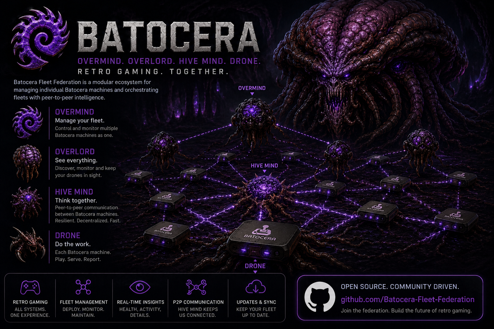

# Batocera Drone

Batocera Drone is a web control panel for your Batocera game system.

After it is installed, you open Drone from a browser on your computer, phone, or tablet. From there you can browse your Batocera library, search games, manage artwork, edit game details, inspect BIOS and theme files, and use admin tools without sitting at the Batocera machine itself.

## What You Can Do With It

- Browse systems, ROMs, BIOS files, artwork, videos, manuals, and theme assets.
- Search your whole game library from one page.
- View and edit game information stored in `gamelist.xml`.
- Upload and manage boxart, screenshots, thumbnails, fanart, and marquees.
- Import artwork and metadata from LaunchBox and TheGamesDB when available.
- Use admin tools for logs, configs, cleanup, system information, and troubleshooting.
- Use the built-in API if you want to automate against your Batocera machine.

## Install On Batocera

You install Drone by running one command on the Batocera machine.

Open a terminal or SSH session to Batocera, then paste this:

```bash
curl -fsSL "https://raw.githubusercontent.com/Batocera-Fleet-Federation/batocera.drone/main/scripts/batocera_install.sh" -o /tmp/batocera_install.sh && chmod +x /tmp/batocera_install.sh && /tmp/batocera_install.sh
```

The installer will ask for the username and password you want to use when opening Drone in your browser.

When it finishes, restart Batocera. If you do not want to restart yet, you can start Drone immediately with:

```bash
/userdata/system/services/DRONE_SERVER start
```

Then open Drone in your browser:

```text
https://<your-batocera-name>.local:8443
```

Example:

```text
https://batocera.local:8443
```

Your browser may warn you about the certificate. That is expected because Drone creates a self-signed local certificate by default.

## Login

Drone is protected with a username and password.

Use the username and password you entered during installation. Do not use an easy password if your Batocera machine is reachable by other people on your network.

## Security

Drone is designed to avoid running as root for normal app work.

The installer creates a dedicated local user called `drone-app`. Drone runs as that limited user and only receives write access to the files it needs to manage:

- Artwork, videos, manuals, and `gamelist.xml`.
- Drone runtime files, local certificates, and Drone logs.

The app should only have read-only access to ROM files, Batocera system configuration, emulator configuration, and most other system files.

In plain language: Drone can update library metadata and media, but it is not supposed to freely modify or delete your ROM collection or Batocera system files.

## API

Drone also includes an API for advanced users and other tools.

The API starts here:

```text
https://<your-batocera-name>.local:8443/v1/api
```

Interactive API documentation is here:

```text
https://<your-batocera-name>.local:8443/v1/api/swagger
```

The machine-readable OpenAPI file is here:

```text
https://<your-batocera-name>.local:8443/v1/api/openapi.json
```

## Overmind Integration

Batocera Drone includes early Overmind integration screens and settings.

Full batocera.overmind coordination is coming soon. The goal is for Drone to act as the local Batocera agent while Overmind coordinates devices, actions, and fleet-level automation.

## Advanced Users

This section is for people who are comfortable with terminals, environment variables, local testing, and API tools.

### Set Username And Password Manually

Drone reads these values when starting:

```bash
DRONE_APP_USERNAME="admin"
DRONE_APP_PASSWORD="change-this-password"
```

The installer and `run_now.sh` use these if they are already set. If they are not set, the scripts prompt you.

### Disable Admin Features

To hide and block admin routes:

```bash
ALLOW_ADMIN=false
```

### Disable Downloads

To prevent ROM and BIOS downloads through Drone:

```bash
ALLOW_CONTENT_DOWNLOAD=false
```

### API Example

```bash
curl -k -u <username>:<password> "https://<your-batocera-name>.local:8443/v1/api/systems"
```

Common API areas include systems, ROM lists, search, BIOS, themes, downloads, artwork/admin tools, logs, configs, and system information.

### Local Mock Server

For non-Batocera development or a quick preview:

```bash
python3 scripts/run_mock_server.py
```

Then open:

```text
http://127.0.0.1:8080
```

Default mock login:

```text
admin / changeme
```

### Uninstall

```bash
userdel drone-app 2>/dev/null || true
rm -f /userdata/system/services/DRONE_SERVER
```

If the installer changed ownership on `/userdata/roms/*/{images,videos,manuals}/` or `gamelist.xml`, those ownership changes remain until you manually change them back.
