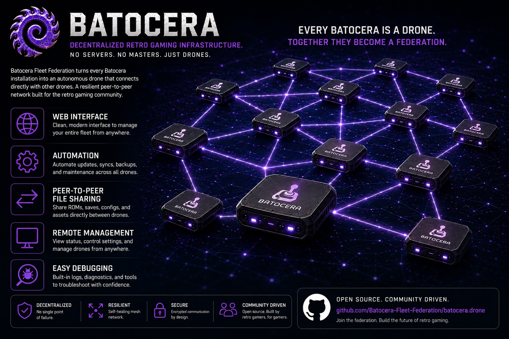

# Batocera Drone

Batocera Drone is a web control panel for your Batocera game system.

After it is installed, you open Drone from a browser on your computer, phone, or tablet. From there you can browse your Batocera library, search games, manage artwork, edit game details, inspect BIOS and theme files, and use admin tools without sitting at the Batocera machine itself.

## TL;DR

- Drone runs on each Batocera device and gives you a local web UI. There is no central hub — every Drone is a standalone agent that pairs directly with a handful of others (peer-to-peer only).
- Drones pair directly over the local network (short-lived 8-digit pairing code) or code-free over a shared Tailscale tailnet. Pairing exchanges and pins each Drone's self-signed certificate; there is no third party granting trust.
- Drone-to-Drone API calls require mTLS with that pinned identity certificate. Drone also creates a hostname-aware HTTPS certificate on startup, so you do not need a public domain or an external CA.
- Local-network/tailnet P2P is always on — it is a fixed property of the architecture, not a toggle, since there is no hub to fall back to if it were disabled.
- Containers are supported for local swarm testing. The Drone container creates a Batocera-like `/userdata` tree and copies a varied set of ROMs from `.github/data/roms/<system>/<files>`.
- The Drone admin header uses the shared project mascot at `content/batocera-swarm-mascot.jpg`.

## What You Can Do With It

- Browse systems, ROMs, BIOS files, artwork, videos, manuals, and theme assets.
- Search your whole game library from one page.
- View and edit game information stored in `gamelist.xml`.
- Upload and manage boxart, screenshots, thumbnails, fanart, and marquees.
- Import artwork and metadata from LaunchBox and TheGamesDB when available.
- Scrape, upload, and crop artwork from the admin artwork page or an individual ROM artwork page.
- Use admin tools for logs, configs, cleanup, system information, and troubleshooting.
- Pair directly with other Drones to browse and copy ROMs, BIOS, artwork, saves, and movies peer-to-peer.
- Use the built-in API if you want to automate against your Batocera machine.

## Install On Batocera

You install Drone by running one command on the Batocera machine.

Open a terminal or SSH session to Batocera, then paste this:

```bash
curl -fsSL https://github.com/Batocera-Fleet-Federation/batocera.drone/releases/latest/download/batocera_install.sh | bash
```

The installer will ask for the username and password you want to use when opening Drone in your browser.

On Batocera v43+, the installer enables the Drone service for future boots and starts it immediately, so no reboot or manual service toggle is needed. (On older Batocera versions, Drone starts on the next boot via `custom.sh`.) If you ever need to start it manually:

```bash
batocera-services start DRONE_SERVER 
```

Then open Drone in your browser:

```text
https://<your-batocera-name>.local
```

Example:

```text
https://batocera.local
```

Drone also listens on `https://<your-batocera-name>.local:8443` for backwards compatibility with older installs and bookmarks.

Your browser may warn you about the certificate until you trust the Drone's downloaded public identity certificate on that client. Drone uses that local identity as its own certificate authority by default.

## Login

Drone is protected with a username and password.

Use the username and password you entered during installation. Do not use an easy password if your Batocera machine is reachable by other people on your network.

## Security

Drone runs as root on Batocera.

The installer only creates the Drone service and runtime directories. It does not create a dedicated `drone-app` user, maintain a read/write allowlist, or rewrite ROM, BIOS, emulator, or Batocera config permissions.

In plain language: Drone can access Batocera files as root, so only run it on machines and networks you trust.

## API

Drone also includes an API for advanced users and other tools.

The API starts here:

```text
https://<your-batocera-name>.local/v1/api
```

Interactive API documentation is here:

```text
https://<your-batocera-name>.local/v1/api/swagger
```

The admin UI also has an **API Access** page. It links to Swagger, shows certificate metadata, and lets you download the public certificate. It does not download or display the private key.

The machine-readable OpenAPI file is here:

```text
https://<your-batocera-name>.local/v1/api/openapi.json
```

## Local Network Mode

There is no central hub. Every Drone is a standalone agent; it discovers and pairs **directly** with other Drones on the local network (or code-free over a shared Tailscale tailnet) and talks to them peer-to-peer. This is a fixed property of the architecture, not an optional integration — it cannot be disabled.

A discovered Drone is not trusted automatically. Open the Local Network page on the other Drone, enter its short-lived eight-digit pairing code, and confirm the pairing. Pairing exchanges and pins each Drone's self-signed certificate by exact fingerprint; private keys never leave their Drone, and there is no shared CA or third party granting trust.

After pairing, the page shows peer health and provides an asset-request workspace for connected Drones. Administrators can browse and copy ROMs, BIOS, artwork, saves, and movies directly from another Drone, or request emulator-config metadata and gameplay history for inspection. Transfers use a recipient-pull queue, run one at a time (single-source, not multi-peer swarming), verify the advertised fingerprint or MD5 when available, and appear in the normal Downloads panel. `TransportSelector` tries LAN-direct, then tailnet-direct, then a legacy direct-WAN/port-forward fallback, best-first — there is no relay of any kind, so a peer that's neither on the same LAN/tailnet nor port-forwarded is simply unreachable.

The Swarm page can also reference a paired Drone's ROM and BIOS library without copying it. New references negotiate a Drone-owned, read-only NFSv4 export over the paired mTLS API, use a same-LAN route before Tailscale when available, and fall back automatically to Batocera's standard read-only SMB share when NFS is unavailable or the source runs an older Drone release. Source-side ROM symlinks (including absolute links into external drives) are resolved into real per-system directories inside the private export, and the client verifies the mounted system inventory before renaming any local folder. Saves and configuration always remain local. Existing active SMB references are not switched underneath a running emulator; they adopt NFS on their next controlled detach/reconnect. TCP port 2049 must be reachable between the two Drones on the LAN or permitted by the applicable Tailscale ACL. Source authorizations are restricted to the paired Drone's exact known LAN/Tailscale IPv4 addresses, restored after reboot, revoked on detach/unpair, and removed by the uninstaller.

`DRONE_NETWORK_SHARE_PROTOCOL` may be set to `auto` (default), `nfs`, or `smb` for rollout diagnostics. NFS mounts are read-only and use bounded failure settings so an offline source cannot indefinitely block Drone or EmulationStation. The relevant tuning overrides are `DRONE_NETWORK_SHARE_NFS_NEGOTIATION_TIMEOUT_SECONDS`, `DRONE_NETWORK_SHARE_NFS_TIMEO_TENTHS`, `DRONE_NETWORK_SHARE_NFS_RETRANS`, and the existing `DRONE_NETWORK_SHARE_ACTIMEO_SECONDS`.

Local mode state, discovered peers, paired peers, pairing codes, and health snapshots are stored in Drone's existing SQLite state database.

Drone also tracks gameplay activity and connection speed purely locally. Gameplay start/stop detection polls Linux procfs for Batocera's active `emulatorlauncher -system ... -rom ...` command every two seconds by default (set `GAME_PROCESS_POLL_SECONDS` to adjust). Speed samples measure the Drone's Internet connection through Cloudflare Speed Test endpoints (`speed.cloudflare.com`); set `DRONE_SPEED_TEST_BASE_URL`, `DRONE_SPEED_TEST_BYTES` (default `1000000` per direction), or `DRONE_SPEED_TEST_TIMEOUT_SECONDS` when a different compatible endpoint or probe size is needed. System information is collected at startup and refreshed occasionally, and can include hostname, OS/platform, Batocera version when available, Drone app version, architecture, CPU count, memory, disk, network addresses, uptime, and whether Drone is running in Docker.

Drone-owned durable state is stored in its local SQLite database: paired-peer and pairing-code state, discovered/health snapshots, upload cursors/fingerprints, credentials, small MD5 lookup results, peer certificate metadata, and processed action/audit history. Existing JSON or action-log state files are imported on first access and removed after successful migration. Normal Drone stdout/stderr logs remain rotating files controlled by `LOG_MAX_BYTES` and `LOG_BACKUP_COUNT`, because log collection tails those streams directly.

Local fake mode is opt-in with `USE_FAKE_DATA=true`. One visible nearby Drone is automatically shown as paired so asset requests can be exercised without completing the pairing flow; the remaining nearby Drones stay unpaired for pairing UI testing. A paired **Demo Arcade Cabinet** is used as a fallback when no nearby Drone has been discovered.

## Drone-to-Drone Security

Drone can protect peer API routes with mTLS. In plain language, one Drone must show its local certificate before another Drone answers peer API calls.

Drone creates or reuses one long-lived, self-signed identity certificate on startup. It does not need Let's Encrypt and does not need a public domain name. Its certificate metadata is shown on the Local Network page and exchanged with a peer during pairing so the paired Drone can pin it. The private key stays on the Drone.

At every service start, Drone also checks a separate HTTPS server certificate in `TLS_SELF_SIGNED_DIR`. It creates or replaces that server certificate when it is missing, damaged, near expiry, or lacks a current hostname, LAN address, or Tailscale address. Unqualified hostnames automatically include their `.local` mDNS form (for example, `batocera.local`). This replacement does **not** change the long-lived identity certificate or its fingerprint, so existing swarm pairings continue to work and Tailscale enrollment/state is untouched. If names and addresses have not changed, the existing server certificate and key are reused.

Browsers, Claude, and other normal HTTPS clients still need to trust the public identity certificate once because it is a private per-device CA. Download it from **Admin > API Access**, install it in the client's trusted root store, and reconnect. Do not install or copy the private key. Clients that intentionally disable certificate verification do not need this step, but lose server-authentication protection.

Useful settings:

```bash
DRONE_MTLS_ENABLED=true
DRONE_CERT_FILE=/userdata/system/drone-app/certs/drone.crt
DRONE_KEY_FILE=/userdata/system/drone-app/certs/drone.key
DRONE_CERT_DAYS=825
```

If you use your own certificate authority, set `DRONE_MTLS_CA_FILE` so Drone can ask the TLS layer to verify peer certificates.

An administrator-approved pairing exchanges and pins each peer's self-signed certificate by exact fingerprint in `/userdata/system/drone-app/local-peer-certs/` — that pinned fingerprint is the only trust path; there is no shared CA. Discovery alone never grants access to peer health, inventory, or files.

For API clients that need mTLS, use your client certificate and key from a trusted system:

```bash
curl --cert client.crt --key client.key -k "https://<drone-host>/health"
```

Keep private keys private. If the identity key is exposed, rotate it and re-pair the Drone with its peers. Routine startup replacement of only the HTTPS server certificate does not require re-pairing.

## Releases

Every commit pushed to `main` creates a GitHub release and advances the latest `vMAJOR.MINOR.PATCH` tag. Normal commits advance the final component, such as `v0.1.50` to `v0.1.51`.

Commit-message prefixes can select a larger version change:

- `increment major version` advances the first component and resets the others, such as `v0.1.50` to `v1.0.0`.
- `incremenet patch version` or `increment patch version` advances the middle component and resets the final component, such as `v1.3.10` to `v1.4.0`.

The workflow builds and uploads `batocera_install.sh`, `batocera_uninstall.sh`, `run_web_now.sh`, and the version-stamped `drone-app.tar.gz`. Manual releases remain available through the Release workflow and `scripts/create-release.sh`.

## Docker

Build the local image:

```bash
docker build -t ghcr.io/batocera-fleet-federation/batocera-drone:local .
```

The container entrypoint creates the folders, configs, logs, and ROM mount points Drone expects on Batocera. For swarm testing, run it through the shared Compose setup in the `.github` repo so each Drone gets a different identity and a copied subset of ROM files.

The shared Compose swarm runs four lightweight Drones with unique hostnames, device ids, MAC addresses, ports, and volumes. Fake data is disabled unless `USE_FAKE_DATA=true` is set.

Publish a multi-arch GHCR image:

```bash
gh auth login
echo "$GITHUB_TOKEN" | docker login ghcr.io -u <github-user> --password-stdin
./scripts/docker-publish.sh --push
```

The publish script targets `linux/amd64` and `linux/arm64`, tags the next patch version, and updates `latest`. Use `--dry-run` to see the version and command without building.

## Advanced Users

This section is for people who are comfortable with terminals, environment variables, local testing, and API tools.

### Set Username And Password Manually

Drone reads these values when starting:

```bash
DRONE_APP_USERNAME="admin"
DRONE_APP_PASSWORD="change-this-password"
```

The installer and `run_web_now.sh` use these if they are already set. If they are not set, the scripts prompt you.

### Disable Admin Features

To hide and block admin routes:

```bash
ALLOW_ADMIN=false
```

### Disable Downloads

To prevent ROM and BIOS downloads through Drone:

```bash
ALLOW_CONTENT_DOWNLOAD=false
```

### ROM Metadata Scanning

ROM inventory is handled by a local, low-priority poller (there is nowhere to upload it to — it exists purely to keep Drone's own SQLite cache current for the web UI and peer transfers). Its initial run waits 60 seconds after startup so Batocera services can settle, and subsequent polls default to every 5 minutes, plus an inotify-debounced wake on filesystem changes. Configure it with:

```bash
ROM_METADATA_POLL_SECONDS=300
ROM_METADATA_INITIAL_DELAY_SECONDS=60
ROM_METADATA_HASH_IO_YIELD_SECONDS=0.05
```

The poller and other Drone-owned durable state share the local SQLite database at:

```text
/userdata/system/drone-app/rom_metadata_cache.sqlite3
```

The database filename is retained for in-place compatibility with existing ROM caches; it now also contains keyed application state, completed action records, paired-peer state, and the ROM/BIOS/save/movie caches. Existing JSON caches are migrated on first use. On each poll Drone scans file size and modified time first, upserts only added or changed rows, deletes rows for removed assets, and hashes only new or changed ROM files (a sampled fingerprint, not a full-file MD5). A completed pass simply marks the local cache clean — nothing is uploaded anywhere. Discovery and hashing work are checkpointed during progress so a restarted Drone resumes from completed hashes instead of starting the metadata build over. Hash reads yield between chunks to avoid monopolizing slower storage, and other filesystem walks are deferred while metadata work is active.

ROM metadata logs show cache load, scan, checkpoint, MD5 hashing, cache update, upload/skip, counts, and durations. The checkpoint cadence defaults to 250 assets or 30 seconds and can be changed with `ROM_METADATA_PROGRESS_FILES` and `ROM_METADATA_PROGRESS_SECONDS`; `ROM_METADATA_HASH_IO_YIELD_SECONDS` controls the storage-friendly pause after each 1 MB hashing read. During metadata activity Drone defers the emulator config crawl and duplicate filesystem telemetry walk so those tasks do not contend for the same drive. Individual ROM paths are not logged by default.

### API Example

```bash
curl -k -u <username>:<password> "https://<your-batocera-name>.local/v1/api/systems"
```

Common API areas include systems, ROM lists, search, BIOS, themes, downloads, artwork/admin tools, logs, configs, and system information.

ROM downloads use the ROM `unique_id` from the API, not the display title. If you see `{"error": "not found"}`, check that the ROM file exists under the configured ROM root and that special characters in the URL are encoded.

### Local Mock Server

For non-Batocera development or a quick preview:

```bash
python3 scripts/run_mock_server.py
```

Then open:

```text
http://127.0.0.1:8080
```

Default mock login:

```text
admin / changeme
```

To test the native Ports client (`ports-client/`, see its own README) against
this same mock server instead of a browser:

```bash
scripts/run_client_now.sh
```

## Uninstall

```bash
wget -qO- https://github.com/Batocera-Fleet-Federation/batocera.drone/releases/latest/download/batocera_uninstall.sh | bash
```

The uninstaller automatically detects and removes either installation style:

- Batocera v43+ service installs in `/userdata/system/services/DRONE_SERVER` or `/userdata/system/services/DRONE_APP`.
- Legacy Batocera installs that start Drone from `/userdata/system/custom.sh`.

It stops Drone, removes its startup configuration, app files, logs, any legacy game-event hook, and the `drone-app` account. It does not delete ROMs, artwork, videos, manuals, or `gamelist.xml` files. Any permissions previously applied to those Batocera content files remain unchanged.
